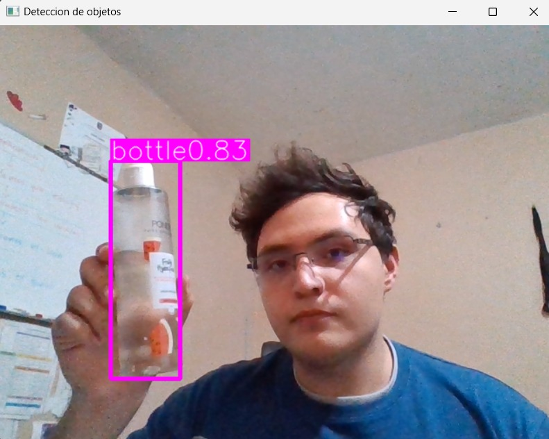
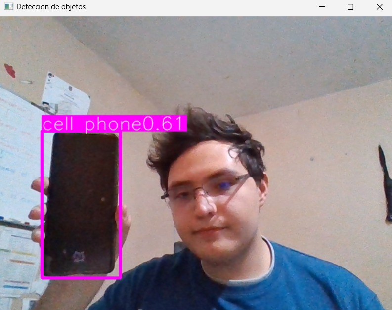
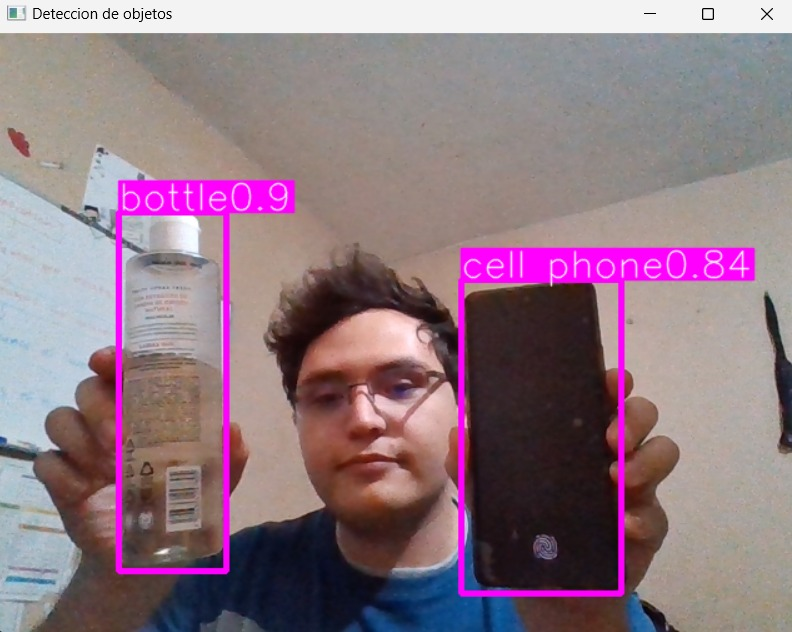

# Detección de Objetos en Tiempo Real con YOLOv8 y OpenCV

Este proyecto utiliza el modelo YOLOv8 y la biblioteca OpenCV para realizar detección de objetos en tiempo real a través de la cámara web. Está configurado para detectar y resaltar objetos específicos, como teléfonos móviles y botellas.

## Tabla de Contenidos

- [Descripción](#descripción)
- [Requisitos](#requisitos)
- [Instalación](#instalación)
- [Uso](#uso)
- [Estructura del Código](#estructura-del-código)
- [Ejemplo de Salida](#ejemplo-de-salida)
- [Personalización](#personalización)
- [Contacto](#contacto)

## Descripción

Este script utiliza el modelo YOLOv8 para identificar objetos en tiempo real desde una cámara web y dibujar un cuadro alrededor de los objetos detectados. Las clases de objetos a detectar son configurables, y el sistema muestra la confianza de detección en la pantalla. El video procesado puede guardarse en un archivo de salida.

## Requisitos

Antes de ejecutar el código, asegúrate de tener instalados los siguientes paquetes:

- **Python 3.x**
- **Ultralytics YOLOv8** para la detección de objetos
- **OpenCV** para la captura y manipulación de video

## Instalación

1. Clona este repositorio en tu computadora:
    ```bash
    git clone https://github.com/ByTRAX78/Vision_IA_YOLOv8.git
    cd Vision_IA_YOLOv8
    ```

2. Instala las dependencias necesarias ejecutando:
    ```bash
    pip install ultralytics opencv-python-headless
    ```

3. Descarga el archivo de pesos YOLOv8 (`yolov8n.pt`) y colócalo en una carpeta llamada `YOLO-Weights`. Puedes obtener el archivo de pesos desde la [página oficial de Ultralytics](https://github.com/ultralytics/yolov5).

## Uso

1. Asegúrate de tener una cámara web conectada y activa.
2. Modifica la ruta del archivo de salida en `cv2.VideoWriter`, si deseas guardar el video procesado.
3. Ejecuta el script:
    ```bash
    python object_detection.py
    ```
4. Una ventana se abrirá mostrando el video en tiempo real con los objetos detectados enmarcados. Presiona `ESC` para detener la detección y cerrar la ventana.

## Estructura del Código

- **Captura de Video**: Utiliza OpenCV para capturar el video en tiempo real desde la cámara web.
- **Modelo YOLOv8**: Carga el modelo YOLOv8 y procesa cada frame para detectar objetos.
- **Filtrado de Clases**: Solo detecta objetos pertenecientes a las clases especificadas en `desired_classes` (teléfonos móviles y botellas).
- **Visualización**: Dibuja un cuadro alrededor de los objetos detectados y muestra la confianza en pantalla.
- **Condición de Detección**: El video procesado se guarda en el archivo de salida especificado, y se muestra en una ventana en tiempo real.

## Ejemplo de Salida

Al ejecutarse, el sistema abrirá una ventana que muestra el video en tiempo real con cuadros resaltando los objetos detectados y la confianza de detección junto a cada cuadro. También puedes guardar el video procesado en un archivo especificando la ruta de salida en `cv2.VideoWriter`.

### Demostración





## Personalización

- **Clases a Detectar**: Modifica la lista `desired_classes` en el código para añadir o eliminar clases de objetos a detectar.
- **Modelo YOLOv8**: Puedes cambiar el modelo de YOLO que se usa modificando la ruta en `YOLO("../YOLO-Weights/yolov8n.pt")` para adaptarla a otro modelo de pesos YOLO.
- **Archivo de Salida**: Cambia la cadena vacía en `cv2.VideoWriter('', cv2.VideoWriter_fourcc('M', 'J', 'P', 'G'), 10, (frame_width, frame_height))` por la ruta donde quieres guardar el video procesado.

## Contacto

Para cualquier consulta o sugerencia, puedes contactar al desarrollador:

- **Nombre**: Adrian Martinez Martinez
- **Correo**: martinezmartinezaadrian@gmail.com
- **GitHub**: [ByTRAX78](https://github.com/ByTRAX78)

